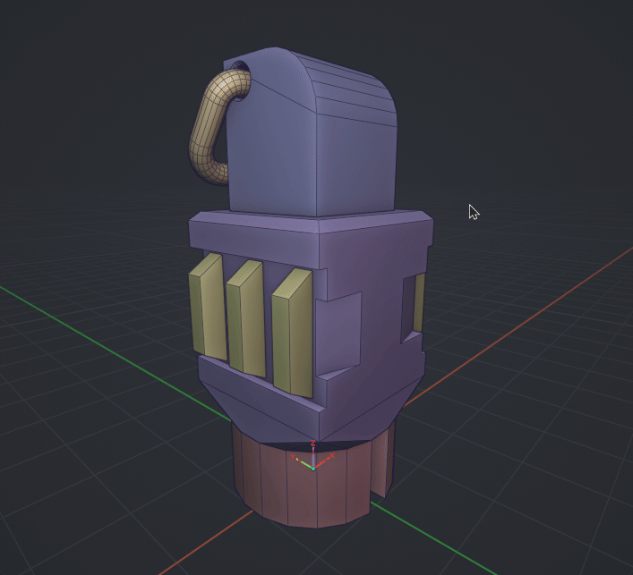

# Cursor Aligned Bounding Box

Blender addon for creating bounding volumes (boxes, hulls, spheres) aligned to the 3D cursor with face marking and coplanar selection.

## Links

- [GitHub Repository](https://github.com/TitusLVR/Cursor_BBox) | [Releases](https://github.com/TitusLVR/Cursor_BBox/releases)
- [Installation](installation.md)

## Key Features

- **Interactive Placement**: Raycast-based cursor alignment to faces and edges.
- **Bounding Shapes**: Box, Convex Hull, and Sphere generation.
- **Smart Selection**: Face marking, coplanar face detection (angle-based), and custom point addition.
- **Visual Feedback**: Real-time wireframe previews and snapping indicators.
- **Customization**: Adjustable push offset, material assignment, and auto-alignment settings.

## Behavior

- **Modes**: Designed for **Object Mode**. In **Edit Mode**, operators calculate bounds based on pre-selected faces.
- **Extension**: Press `A` during any interactive session to add manual points, expanding the bounding shape beyond the geometry.
- **Construction Plane**: Press `C` while in point mode to toggle a construction plane for precise snapping to intersections.

**Version**: 1.1.0
