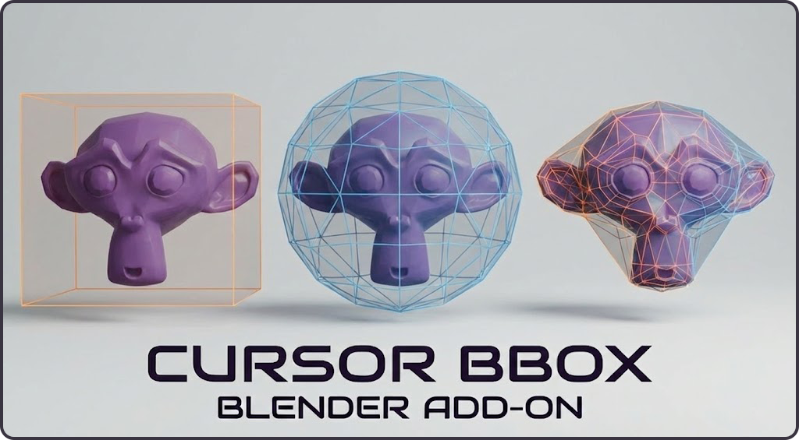

# Cursor Aligned Bounding Box

Blender addon for creating bounding volumes (boxes, hulls, spheres) aligned to the 3D cursor with face marking and coplanar selection.

## Links

- [GitHub Repository](https://github.com/TitusLVR/Cursor_BBox) | [Releases](https://github.com/TitusLVR/Cursor_BBox/releases)
- [Installation](installation.md)

## Key Features

- **Interactive Placement**: Raycast-based cursor alignment to faces and edges.
- **Bounding Shapes**: Box, Convex Hull, and Sphere generation.
- **Smart Selection**: Face marking, coplanar face detection (angle-based), and custom point addition.
- **Visual Feedback**: Real-time wireframe previews and snapping indicators.
- **Customization**: Adjustable push offset, material assignment, and auto-alignment settings.

## Controls

| Key | Action | Details |
| :--- | :--- | :--- |
| **Space** / **Enter** | Confirm | Create the bounding shape and exit |
| **ESC** | Cancel | Exit without creating geometry |
| **S** | Snap | Snap cursor to nearest vertex, edge center, or face center |
| **F** | Mark Face | Toggle face marking (Box mode) |
| **A** | Add Point | Add a custom point at cursor location (Hull/Sphere) |
| **C** | Coplanar / Plane | Toggle coplanar selection (Normal) or Construction Plane (Point Mode) |
| **Z** | Clear | Clear all marked faces and points |
| **Shift+Alt+C** | Pie Menu | Open addon pie menu (Global) |
| **Mouse Wheel** | Rotate | Cycle cursor rotation (Box mode) |
| **Shift + Wheel** | Angle | Adjust coplanar angle threshold |

## Parameters (N-Panel)

| Parameter | Default | Description |
| :--- | :--- | :--- |
| **Push Offset** | `0.01` | Inflation margin for generated geometry. Negative values shrink. |
| **Align to Face** | `True` | Automatically align cursor rotation to face normals. |
| **Auto-Select Coplanar** | `False` | Enable coplanar selection by default on startup. |
| **Angle Threshold** | `5°` | Angular tolerance for coplanar face detection. |
| **Use Material** | `False` | Assign a debug material to created meshes. |
| **Color** | `Orange` | Color for debug material and UI highlights. |
| **Collection** | `CursorBBox` | Name of the collection where shapes are created. |

## Behavior
- **Modes**: Designed for **Object Mode**. In **Edit Mode**, operators calculate bounds based on pre-selected faces.
- **Extension**: Press `A` during any interactive session to add manual points, expanding the bounding shape beyond the geometry.
- **Construction Plane**: Press `C` while in point mode to toggle a construction plane for precise snapping to intersections.

**Version**: 1.0.9
