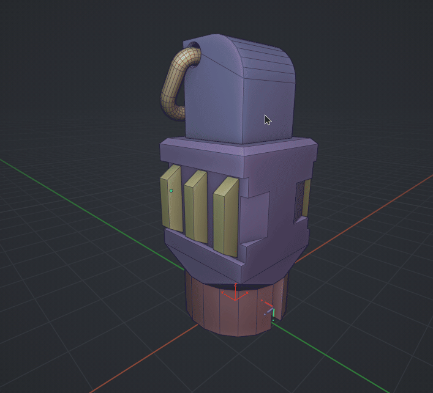

# Set & Fit Box

Set cursor and immediately fit a Bounding Box.

- **Description**: Quickly places the cursor and generates a box in one action. Works with multiple objects.

- **Controls**:

  - `LMB`: Create Box (on hovered object)
  - `E`: Toggle Extend Mode
  - `G`: Create Combined Box (for all selected)
  - `A`: Create Individual Boxes (for all selected)
  - `W`: Toggle World Orientation
  - `Q`: Toggle Local Orientation
  - `D`: Toggle Depsgraph (Modifiers)
  - `RMB`: Done / Exit
  - `ESC`: Cancel
